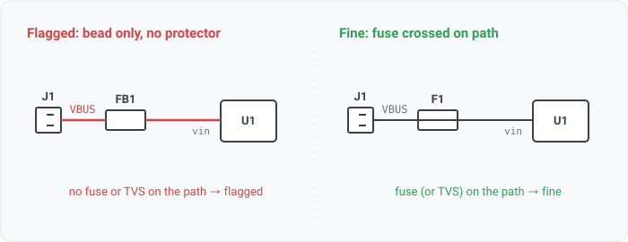
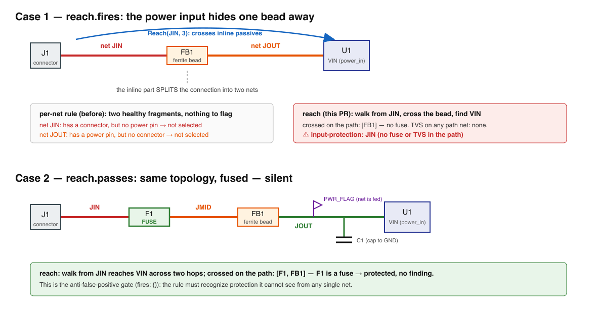
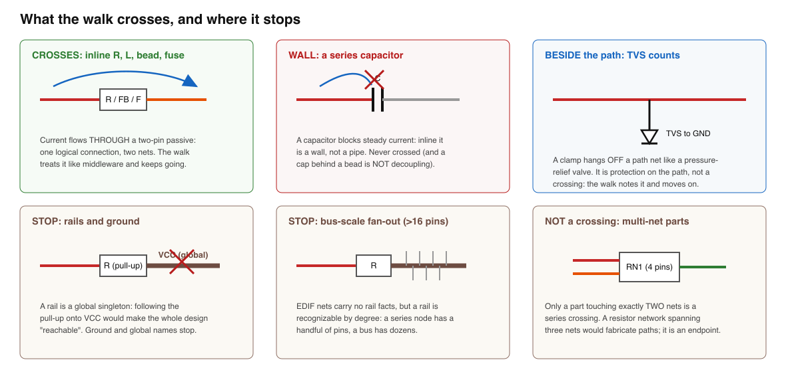

## input-protection

### What it means

A connector net that reaches a power-input pin, directly or through up to three series parts, must
have a protection device on the way, a fuse crossed or a TVS on the path.

### Why engineers want it

The power entry is the one net every external fault arrives on.
Review checklists ask for a fuse (overcurrent) and a clamp (transient) between the jack and
the first regulator; forgetting them is invisible until the wrong charger shows up.

### Impact

Shorted loads burn traces or supplies instead of opening a fuse; hot-plug and
ESD transients reach the regulator input unclamped.

### Scope note

Since WS3-011 the rule walks from each connector net, following series pass elements
(R/L/ferrite/fuse, the reach primitive, 3 hops) to find a power-input pin, and the path is protected
if a FUSE was crossed to get there or a fuse or TVS hangs on any walked net up to it. Before the
walk, a series element split the net and the rule saw nothing, so a fuse-protected board passed by
accident, and an unprotected connector-bead-regulator path passed too (the false negative this
upgrade closes). Fuse OR TVS satisfies the rule; a per-design "which protections are required"
policy is rule configuration (WS3-006). Ground-named nets are skipped, and an unresolved external
net reports not-considered.

### Query structure

select connector nets whose reach finds an unprotected power input.

    select N in nets where exists C in N.connections where class(C) == connector
      and exists M in reach(N, 3) where exists P in M.connections, pin_dir(P) == power_in
      and not (fuse crossed on path(N..M) or exists T on path nets, class(T) in {fuse, tvs})

Reads: component.class, net.attributes (external), net.names (the ground-name skip), on_net,
pin.electrical_type, reach. Tier R.

### For software readers

A schematic is a graph whose components are nodes with named pins and whose nets are hyperedges
joining pins that are wired together. The concepts this rule leans on:

- A **series ("pass") element** is a two-terminal part wired INLINE, like middleware in a
  request pipeline. Because a net is "everything directly touching", an inline part SPLITS
  one logical connection into two nets, leaving a per-net rule like a function
  that can only see its own local scope.
- A **fuse** is a sacrificial circuit breaker, wired inline. "Is there a fuse between the wall
  plug and the machine" is a PATH question, like "does any middleware in the chain do auth".
- A **TVS diode** is a surge protector hanging OFF the path to ground like a pressure-relief
  valve; it is protection on a path net, not a crossing.
- A **ferrite bead** is an inline noise filter, electrically transparent here, and the classic
  innocent reason a power path is split into two nets.
- A **rail** (VCC, GND) is a shared supply net like a global singleton; the walk never crosses
  into one.

The two conformance fixtures, drawn:

The walk's crossing and stopping rules at a glance:

