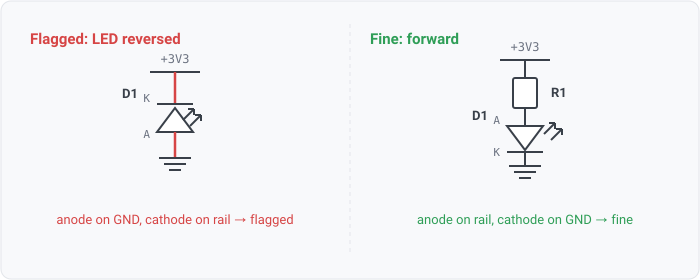

## led-polarity

### What it means

An LED whose anode pin lands on a ground-named net while its cathode
lands on a power-rail-named net. Current would have to flow from ground to the rail; the
LED never conducts.

### Why engineers want it

LED polarity is the classic capture slip: the symbol is
symmetric-looking, the footprint is not, and the netlist connects fine either way. Every
review checklist has "check LED orientation" precisely because no electrical check
catches it: both pins are properly wired, just to the wrong ends.

### Impact

A dead indicator discovered at bring-up; rework if the footprint is not
hand-flippable.

### Pin roles are derived, not stated

No format carries polarity as data (KiCad LED pins
are electrically passive; "A"/"K" are pin names), so the anode/cathode roles come from the
name convention gated by device class, via pin.role, the same projection posture as
component.class. An LED whose pins carry no recognizable names yields RoleUnknown and the
rule stays silent (never guess).

### LED-only, on purpose

A zener or TVS wired cathode-to-rail is correct usage; the
general diode-orientation rule needs net-polarity facts and is tracked with the WS3-003
corpus row, not here.

### Query structure

select LEDs whose role-resolved pins land on opposing rails.

    select C in components where class(C) == led
      and ground_name(net_of(anode(C))) and rail_name(net_of(cathode(C)))

Reads: component.class, net.names, on_net, pin.role. Tier R.