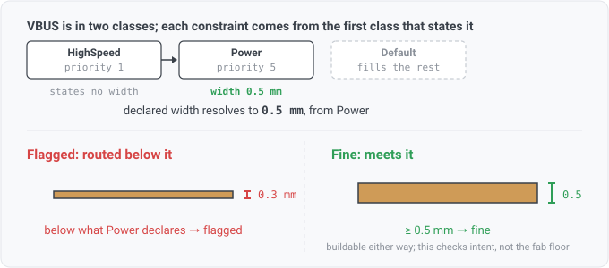

## netclass-track-width

A net is routed narrower than the track width its own net class declares.

## What this checks

The project's `net_settings` states, per net class, the track width that class's nets are meant to
route at. This compares each net's thinnest routed segment against that declared width and reports
the nets that fall short.

There is no number in this rule. The limit comes entirely from the design.

## How it differs from `track-width`

They look similar and answer different questions.

`track-width` asks **can this be built**: it compares copper against a universal fabrication floor
(0.127mm) that no mainstream process goes below. A finding there means the board may be rejected at
order time.

This rule asks **is this what you asked for**. It compares copper against the project's own stated
intent. A finding here can sit on a board that manufactures perfectly well: a power net declared at
0.8mm but routed at 0.3mm is buildable and is still wrong, because the 0.8mm was chosen for current
and heat.

A net can pass one and fail the other, in both directions.

## Resolving the declared width

A net can belong to several classes at once, and this is where a naive implementation goes wrong.

KiCad does not pick one of a net's classes and use it wholesale. It fills each constraint from the
highest-priority class that states **that** constraint, and the `Default` class supplies whatever is
left over. `Default` applies to every net, including nets in no class at all. So a net in a
high-priority class that declares only a clearance still takes its track width from the next class
down, and a net in no class still has a width it is expected to meet.

Comparing a net's copper against every class it belongs to would fail nets that correctly obey the
class that won. The rule resolves the cascade first, then compares once, and the finding names the
class the limit came from.

## Hardware context (for software readers)

- **Net class**: a named group of nets sharing routing constraints. Structurally a tag set used as a
  policy scope.
- **Track width**: how wide the copper trace is. Wider carries more current and runs cooler; on a
  controlled-impedance net the width is part of what sets the impedance.
- **Why the declared width matters**: it encodes a decision someone made about current, heat, or
  impedance. Routing narrower silently discards that decision.

## Absence is not a pass

The rule declares `CapNetClassDefs`. A design that declares no net-class definitions has no limit to
compare against, so the rule reports not-applicable rather than running over zero comparisons and
reading clean. Only a KiCad project read supplies definitions; an EDIF netlist, an IPC-2581 board and
a bare `.kicad_sch` all leave them empty.

The rule is also silent on a net with no routed copper, since there is nothing to measure.
