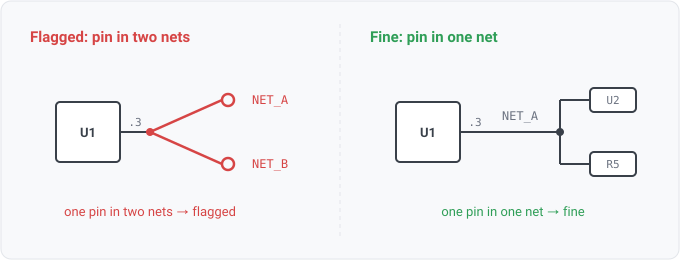

## pin-net-conflict

### What it means

One (component, pin) appears in the connection lists of two or more
nets. A net is the equivalence class of electrically joined pins, so membership is
many-pins-to-one-net by definition; multiple membership is not a design error a person
drew — it is malformed input from a reader bug or a corrupt export.

### Why engineers want it

They should rarely see it. It exists as the integrity tripwire
behind every per-pin net question the engine answers (pin.role consumers, diff keys,
viewer highlights): when the invariant breaks, this fires instead of every downstream
answer silently becoming arbitrary. PinNetName documents that it reports the first net in
design order; this rule is why that arbitrary pick is safe. A firing points at the READ,
not the design: its first corpus run surfaced two reader gaps (unannotated placeholder
refs merged, WS1-024; duplicate port designators collapsed, WS1-025).

### Impact

Without the tripwire, an inconsistent netlist degrades every derived answer
quietly. With it, the file is flagged at check time with the claiming nets named.

### Severity is info, deliberately

Both known producers of this state are reader gaps
(WS1-024, WS1-025), so today a firing points at the tool's read of the file, not at the
design — flagging it louder would blame the engineer for our keying. Revisit via severity
configuration (WS3-006) once the reader fixes land and a firing is anomalous again.

### Two deliberate suppressions

A duplicated ref-des produces this state mechanically —
each colliding placement brings its own copper, so their shared (ref, pin) key lands in
several nets. That root cause is duplicate-ref-des's finding; pins of collided ref-des
are skipped here so one authoring slip yields one finding, not two. (Found on the
sheetnav conformance fixture the moment this rule first ran: the tripwire works, it just
caught prey that already had an owner.)

The second is an UNANNOTATED ref-des — `R?`, `C?`, `REF**`, or a partly-assigned
`C?1845`. This rule asserts something about a PIN, and `(R?, 1)` does not name one: on one
export 176 distinct un-annotated resistors shared that key, so the index saw a single pin
sitting on 129 nets and 77% of this rule's findings on that design described a netlist that
was fine. The design is not malformed; the key is not a key. Declining to assert uniqueness
over a non-identity is not the same as hiding a defect, and the un-annotated parts are a
finding in their own right rather than a silence.

### Query structure

report each conflict the model collected.

    select P in pin_net_conflicts
      where not ref_des_collided(P) and not ref_des_unannotated(P)

Reads: pin.on_net, ref_des_collision (the suppressions). Tier P.