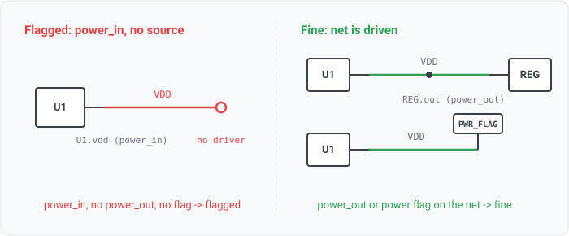

## power-input-not-driven

### What it means

A net that has a power-input pin (a VCC/VDD/rail-consuming pin) but no power
source, meaning no driving pin (output, power-output or bidirectional) and no power flag
asserting the rail is fed elsewhere.

### Why engineers want it

This is KiCad's ERCE_POWERPIN_NOT_DRIVEN, and the reason power flags
exist. A rail is often drawn as a named net (+3V3) with the regulator on another sheet; capture
tools cannot see the source without either a power-output pin on the net or an explicit flag. A
power-input with neither is almost always a real omission, where the rail was named but never connected.

### Impact

The part (or a whole supply domain) is unpowered. It is one of the highest-consequence
capture errors and only shows up at first power-on.

### Scope note

The rule needs the power-in / power-out split (a reader that collapses both to a generic
power pin cannot distinguish source from sink, so the rule reports its nets not-considered). A power
flag on the net, recorded by the reader, counts as driven. A net that continues onto a sheet the read
did not open is not judged, since its feed may be there.

A lone exposed pad and a divider tap into a sense pin are not considered either. Both carry a pin a
vendor symbol types power_in, and neither draws a supply, as decoupling-present's page describes (agni
issue 935).

Concretely, the rule is gated OFF on a source format that does not type power OUTPUTS. EDIF's port
grammar carries only INPUT/OUTPUT/INOUT and IPC-2581 is a board format with no pin electrical types
(the `design.types_power_out` fact). There a rail's driver reads as a plain input, so "no power source"
would false-fire on every switched or derived rail. The power-INPUT side is stamped on EDIF
(WS3-072), which is enough for the power-in-only rules (decoupling-present, input-protection). This
rule stays gated until the reader stamps power outputs on those formats.

### Query structure

select nets with a power-input, no driver, and no power flag.

    select N in nets where any(power_in(P)) and not any(driver(P)) and not power_driven(N)

Reads: net.attributes (power_driven, external), on_net, pin.electrical_type. Tier R.