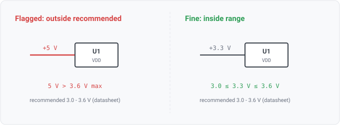

## rail-nominal-out-of-recommended

### What it means

A component joined to a seeded datasheet spec (by MPN) has a power-input pin on a rail whose
name states a nominal voltage outside the spec's recommended operating supply range
(VIN/VDD/VCC-family symbol, limit kind RECOMMENDED_OPERATING, min..max). The
recommended-operating sibling of `supply-exceeds-abs-max`: same datasheet join, but the
vendor's functional envelope rather than the destroy-it ceiling.

### Why engineers want it

The absolute-maximum rating says where the part is damaged; the recommended operating range
says where its datasheet specifications are guaranteed. A rail between the two still runs the
part, but outside the vendor's characterized conditions: margin, accuracy, timing, and lifetime
are no longer assured. Like its sibling, the range is the vendor's own number, carried with
provenance (document revision, page, table, extraction method, confidence) into the finding, so
a reviewer verifies the citation rather than trusting the tool.

### For software readers

A rail is a global constant every consumer reads; the recommended range is the part's declared
precondition on that constant. `supply-exceeds-abs-max` is the hard assertion that crashes the
process (exceed it and the part may be destroyed); this rule is the softer contract check that
the input is inside the documented, supported range, where behavior is defined. Being outside it
is like calling an API with an argument outside its documented domain: it may return something,
but nothing about the result is promised.

### Evidence honesty

Every input that cannot be trusted is a skip, never a guess:
- no MPN, unseeded MPN, or no seeded set at all -> silent (skip-not-false-pass);
- limit rows that are under-specified or carry text-only conditions are not compared
  (param.MachineComparable, docs/20 comparison semantics);
- a row printed in a prefixed unit (mV, kV) is reduced to volts by the parameter layer's one
  conversion table, and BOTH bounds of the range are reduced together; a unit that table does not
  recognize is skipped rather than scaled by a guess;
- a rail name with no parseable nominal, or with conflicting nominals, is not compared;
- a part that declares MORE THAN ONE recommended supply range is skipped entirely: a netlist
  does not label which power-in pin is which supply, and the range is two-sided, so an
  unlabeled pin cannot be matched to the right range without risking a false finding (per-pin
  supply mapping is a follow-up). Its one-sided sibling has no such restriction because a
  ceiling is conservative to apply across every power-in pin.

### Query structure

join components to specs by MPN; act only on a part with a single machine-comparable
recommended supply row; for each power_in pin, parse the attached rail's nominal from its net
name and flag it when it is above the row's max or below its min.

    select C in components where spec(C) != nil
      let R = recommended_operating(spec(C)) where |R| == 1
        for P in pins(C) where electrical_type(P) == power_in
          nominal(net(P)) > max(R) or nominal(net(P)) < min(R) -> finding

Reads: param.recommended_operating, pin.electrical_type, net.name, on_net. Tier R.
