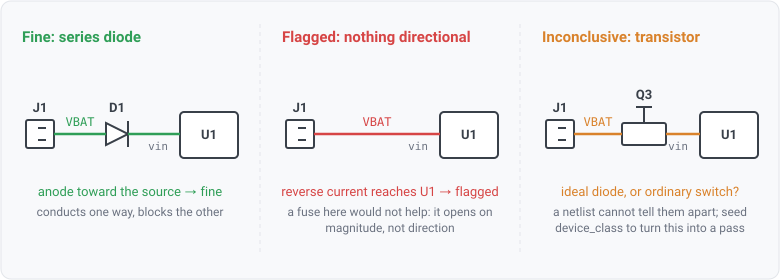

## reverse-blocking-absent

### What it checks

A connector feeds a power-input pin, and nothing on the path between them blocks current flowing the
**wrong way**.

### For hardware engineers

Two failures share one mechanism.

**Reverse polarity**: a connector is wired backwards, or a technician plugs in a supply the wrong way
round. Current flows into the board through what should be its return path. On a vehicle this is a
qualification requirement, not a nicety. ISO 16750-2 makes reverse voltage a test the module has to
survive.

**Reverse current (backfeed)**: two sources share a rail, or a rail is switched off while something
downstream still holds charge. Current flows back up a path that was only ever designed to carry it
forward, powering a domain that is supposed to be dead. That is why an industrial board carries an
ORing FET or an ideal-diode controller.

Both need a **directional** element: something that conducts one way and not the other. A series
diode, an ORing FET, an ideal-diode controller.

The three panels are the rule's three answers. The middle one is the defect. The right-hand one is
the case worth understanding, and the next two sections are about why it is not reported as either
of the other two.

### Why a fuse or a TVS does not count

This is the whole reason the rule exists separately from `input-protection`.

A **fuse** opens on current *magnitude*. It does not care about sign, so it will not stop reverse
current until the reverse current is large enough to blow it, by which point the damage is upstream
of the fuse.

A **TVS** shunts transients to ground. It clamps a voltage spike; it does not block a path.

So "a fuse or a TVS is present" carries no information about whether reverse flow is blocked. Two
review items on a real design were bound to `input-protection` for exactly this reason and were reading pass with
their real ask never tested.

### What it will not claim, and why that is deliberate

**A path crossing an unidentified transistor is reported INCONCLUSIVE, not as a defect.**

A P-FET ideal diode is a transistor plus a bias network. Nothing in a netlist labels that arrangement,
and it is structurally indistinguishable from any other FET sitting in a power path. It is also the
*correct modern answer* to reverse protection, so a rule that fired whenever it found no series diode
would false-fail every well-designed ORing-FET board.

A false fail here is worse than the gap it would close. A reviewer who sees this rule fire on a
properly protected design learns to ignore it, and then it is worth nothing on the design that really
is missing protection.

**It used to stay silent instead, and that was the wrong answer for a reason invisible at the rule
layer.** A review item bound to this rule read silence as a PASS, so the report asserted protection on
a path nothing had verified. The rule now says out loud that it could not decide, and a bound item
reads `inconclusive`: neither a defect nor a clean bill of health.

**A controller the datasheet identifies resolves it.** Seed the part with a `device_class` of
`ideal_diode_controller` (the alias set also accepts the ORing, power-mux and power-path spellings) and
the rule credits it as a genuine directional element and goes properly silent. That is what turns an
inconclusive into a real pass, and it is why the message names the exact class to seed.

### Orientation matters

A diode only counts when it is fitted the right way round: **anode toward the source**, cathode toward
the load. Fitted the other way it blocks the supply rather than the fault, which is a different defect
and not the one this rule reports.

Only a plain diode counts. A TVS, a Zener and an LED all carry the diode family tag, and none is a
series blocking element: the first two shunt to ground, and an LED in a power path is an indicator.

### When it stays silent (a genuine pass)

- No connector on the net, since the rule is about what enters the board.
- No power input reachable from it.
- A transistor on the path that a seeded datasheet identifies as an ideal-diode / ORing controller
  (above). An UNIDENTIFIED transistor is not silence: it is an inconclusive finding.
- A diode whose part type declares no anode pin, so orientation is unknown. The path reads as
  unblocked rather than the rule guessing which way the part faces.
- Ground and read-gap (external) nets, excluded up front.

### Fixing a finding

Add the directional element, or record why the path does not need one. A path fed from a source that
physically cannot be reversed (a fixed internal rail rather than a user-facing connector) is a
legitimate exception, but it is worth writing down, because the next reviewer will ask the same
question.
