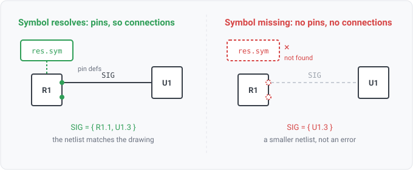

## symbol-unresolved

### What it means

A symbol reference the reader could not open or parse: an xschem or gEDA `.sym` file, or a KiCad
external `.kicad_sym` library named by a `lib_id` the schematic does not embed. The schematic itself
parsed fine. Only the file holding the part's pin definitions is missing.

### Why engineers want it

A symbol carries a part's terminals. When it fails to load, the placement keeps its reference
designator and gains no pins, and a part with no pins has no connections. So the netlist is missing
every connection those parts make, and nothing about the result looks wrong: the design reads as
valid and simply emptier than it is.

That is the whole failure mode. A missing library does not produce an error, it produces a smaller
netlist. Connectivity rules then run over the incomplete read and report a clean pass, which is
indistinguishable from a design where those connections were never drawn.

### Impact

Every connection made by the affected parts is absent from the netlist. The reader compounds this
by design: dangling-endpoint findings are suppressed whenever any symbol fails to resolve, because a
missing pin turns a real wire end into a phantom dangle. Without this rule, the only visible effect
of a lost symbol is that the design reports LESS than it would have.

### What it does to other rules

Any unresolved symbol gates every rule that reads a pin or connectivity fact to `inconclusive` for
the whole design, rather than letting it pass over an incomplete netlist. The gate is DESIGN-WIDE,
which is deliberately the conservative reading and matches what the readers already do with dangling
endpoints: one unresolved placement suppresses the whole design's dangles.

Narrowing it to only the affected parts needs a mapping from a finding back to the ref-des it
concerns, which does not exist yet. Until it does, a narrower gate would amount to asserting that
the parts not flagged are unaffected, and the reader cannot support that claim.

`inconclusive`, not `not-applicable`: a missing source-format capability is permanent, while an
unresolved symbol is a property of THIS read that a `--symbol-path` away is fixable.

### The one subtlety

Warning severity, though the effect on the netlist is as corrupting as a ref-des collision, which is
an error. The difference is whose fault it is. A collision is an annotation slip in the design. An
unresolved symbol is almost always a defect in the invocation: no `--symbol-path`, a library not
checked out, a file not mounted. The board itself may be flawless, and every FAIL is supposed to be
a genuine defect.

Reading without symbols at all (the plain `Read` entry, no opener) reports nothing. That is a caller
deliberately asking for names-only, not a resolution failure.
