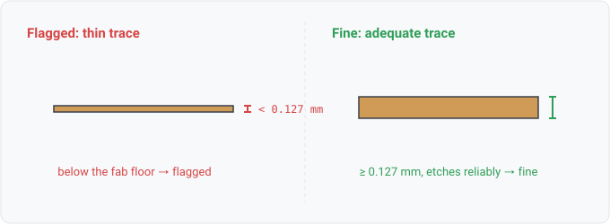

## track-width

### What it means

A routed copper segment narrower than 0.127mm (5mil), the minimum trace
width of the loosest mainstream fabrication capability (the corpus JLCPCB rule set).

### Why engineers want it

Track width is the first constraint every fab publishes and
every DRC ships. Below the floor the fab rejects the board or
etches it unreliably.

### Impact

At best the fab rejects the board at order time. At worst the trace etches into intermittent opens
and fails under current.

### Scope note

The 0.127mm default is deliberately the loosest published floor, so the
rule fires on defects rather than on deliberate tight routing under a capable fab's own
rules; per-design thresholds arrive with rule parameterization (WS3-006), and
`netclass-track-width` checks the width a project's own net classes declare. `check.Available` gates
the rule behind the board-geometry tier (a netlist-only design reports not-applicable, not
a silent pass).

### Query structure

select nets with any segment below the floor.

    select N in board.nets where count(S in N.segments where width(S) < 0.127mm) >= 1

Reads: board.copper. Tier P.