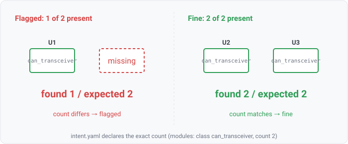

## module-count

### What it means

When the design intent declares an exact count for a module (2 CAN transceivers, 4 radios), this
rule fails if the number of design components matching that module's criterion differs. It is the
complement of `module-missing`: missing asks "is at least one present", count asks "are there
exactly N" — too few OR too many both fail.

### Why engineers want it

A dropped or duplicated channel is invisible to a presence check. A two-CAN design that lost one
transceiver in a schematic edit still "has a CAN transceiver", so `module-missing` passes; only a
count check catches the missing second channel. Over-count catches the opposite mistake (a
copy-paste that left a stray instance).

### Impact

The design has the wrong number of a required block: a missing redundant channel, a dropped
interface, or a duplicated part that doubles cost and load. It matches the declared architecture in
kind but not in quantity.

### Scope note

Only modules that set a count are checked, so a declaration with modules but no counts compiles to no
count rule (empty-set-is-silent). Counting by MPN requires a params-built model, same as the
`module-missing` MPN path. Like every intent rule the expectation comes from the declaration, never
enumerated from the netlist.
