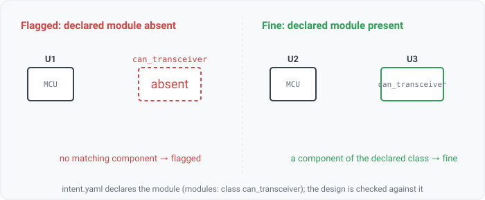

## module-missing

### What it means

The design intent declares which functional blocks the schematic is required to contain (a SoC,
a CAN transceiver, a regulator). This rule fails once per declared module that no design component
satisfies. A module matches when any component carries its declared device class, or its exact MPN
(the MPN path resolves only on a model built with a params corpus, from `--params` or the
project's `params` directory).

### Why engineers want it

"All required modules present" is a design-review question the netlist cannot answer on its own,
because the schematic says what IS wired, not what was SUPPOSED to be there. A dropped block (a
forgotten transceiver, a regulator left off a respin) reads as a perfectly valid netlist. The
declared architecture is the external reference the design is checked against.

### Impact

A required functional block is absent, so the board is missing a capability its architecture called
for. Caught at review it is a one-line respin note; missed, it is a bring-up blocker or a field
recall.

### Scope note

The rule iterates the declared modules and probes the design, so the expectation set comes from the
declaration rather than the netlist and a missing module fails. A rule that enumerated modules
from the design would always pass (circular), the silent false-pass this family of rules
exists to prevent. There is no built-in intent; the declaration is loaded per design, from the
`intent:` section of its `design.yaml` or from `--intent-path`, so a design run with none leaves the item
`needs-design-intent` rather than silently passing.
