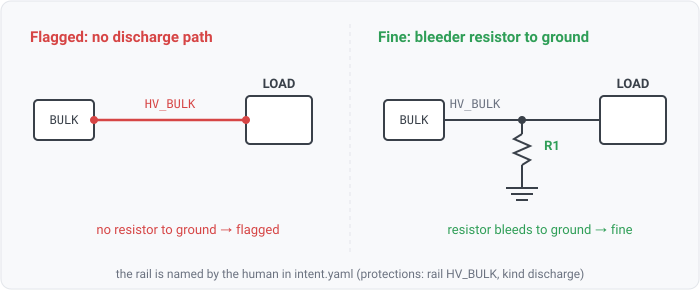

## protection-discharge

### What it means

The design intent declares that a named rail must have a discharge path: a bleeder resistor that bridges
the rail to ground so stored charge drains when the supply is removed. This rule fails when the declared
rail carries no such resistor — it probes that exact net for a component that is a resistor AND also
touches a ground net, and a declared rail with none is flagged.

### Why engineers want it

A rail with bulk capacitance stays energized after power-down. A bleeder gives it a defined,
intended discharge path so the rail is safe to touch and predictable on the next power cycle. Which
rails need bleeding is an architecture decision the netlist does not state, so the intent declaration
names the rail and this rule verifies the resistor-to-ground is present.

### Impact

A rail the design was intended to discharge holds charge after power-down: a shock or arc hazard on a
high-voltage rail, or unpredictable power-sequencing on the next cycle because a capacitor never bled
down.

### Scope note

`discharge` is realized by a resistor that also reaches a ground net (name-derived ground, the same
predicate the `net.ground` fact uses). It is one of the per-kind protection rules
(`intent/protection-ovp`, `intent/protection-discharge`), each emitted only when the declaration
carries that kind. The rule iterates the declared protections and probes the design; it never derives
the protected-rail set from the netlist.
