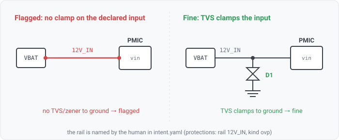

## protection-ovp

### What it means

The design intent declares that a named rail must be over-voltage protected. This rule fails when the
declared rail carries no clamp: it probes that exact net for a TVS or a zener among its components, and
a declared rail with none is flagged. It keys on the declared net NAME (not the rail-role heuristic,
which misses names like `VBATT01` that carry no voltage token), so an input rail the customer names
explicitly is checkable.

### Why engineers want it

An input that can see a transient (a battery rail, an off-board connector) is supposed to have a clamp
that shunts the spike to ground before it reaches downstream silicon. Whether a given rail was intended
to be protected is an architecture decision, not something the netlist states, so the intent
declaration names the rail and this rule verifies the clamp is actually on it.

### Impact

A rail the design was intended to protect has no OV clamp, so a transient reaches downstream parts:
latch-up, degraded silicon, or an immediate failure on a hot-plug or load-dump event.

### Scope note

`ovp` is realized by a TVS or a zener on the rail (`component.class` tvs/zener). It is one of the
per-kind protection rules (`intent/protection-ovp`, `intent/protection-discharge`), each emitted only
when the declaration carries that kind, so distinct review items bind independently. The rule iterates
the declared protections and probes the design; it never derives the protected-rail set from the
netlist.
